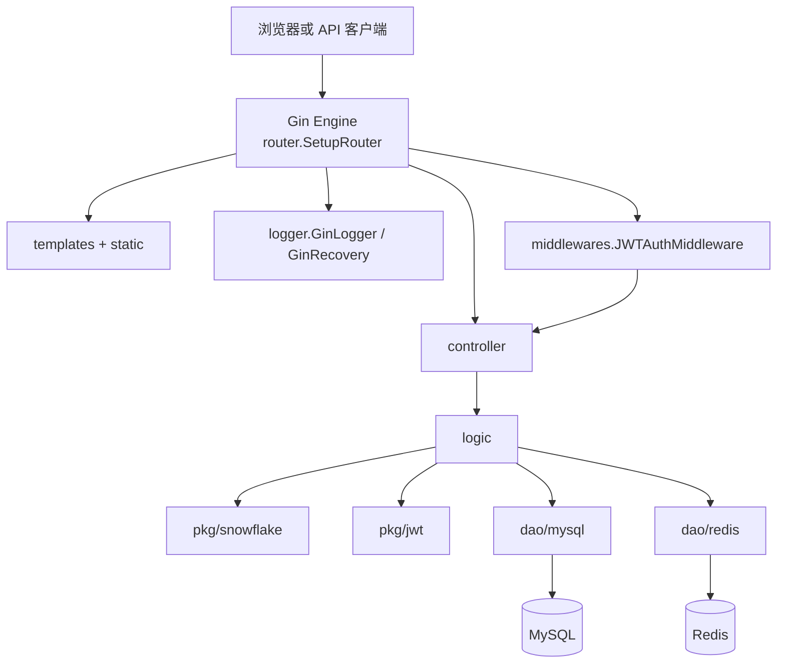

# 架构说明

## 架构结论

当前实现是一个分层单体，而不是微服务：一个 `main` 进程完成配置、日志、数据连接、ID 生成、校验翻译、路由和 HTTP 生命周期管理。业务依赖方向大体为 `router → middlerwares/controller → logic → dao/models/pkg`；MySQL 是业务实体的持久化事实来源，Redis 是帖子时间、热度分数和投票状态的事实来源。

## 运行与组件图



图中的依赖由 `main.go: main` 和 `router/router.go: SetupRouter` 的装配，以及各 `logic` 文件的 import/调用验证。`controller` 也直接依赖 `pkg/jwt` 的中间件上下文结果，但不会直接访问数据库。

## 启动与生命周期

`main.go: main` 按以下顺序启动：

1. `setting.Init`：Viper 从 `./conf/config.yaml` 读取配置，并注册文件变化监听。
2. `logger.InitLogger`：按环境选择文件 JSON 日志及开发控制台日志。
3. `jwt.Init`：要求配置提供至少 32 字节的 JWT 密钥；缺失时拒绝启动。
4. `mysql.InitMySQL`：连接 MySQL，并对 `User`、`Community`、`Post` 执行 `AutoMigrate`。
5. `redis.InitRedis`：使用传入的完整 Redis 配置创建客户端并 `PING`。
6. `snowflake.Init`：以配置中的起始日期与机器号初始化 ID 节点。
7. `controller.InitTrans("zh")`：为 Gin 参数校验注册中文翻译。
8. `router.SetupRouter`：装配中间件、静态资源、业务路由、Swagger 和 pprof。
9. `http.Server.ListenAndServe`：在 goroutine 中服务；收到 `SIGINT/SIGTERM` 后最多等待 5 秒优雅关闭。

初始化是“快速失败”：任一步返回错误，`main` 记录日志后直接返回。关闭路径调用 MySQL 与 Redis 的 `Close`，并同步 logger。

## 分层职责与接口

| 层/模块 | 当前职责 | 主要入口 | 状态/副作用 |
| --- | --- | --- | --- |
| `router` | URL、公开/受保护边界、静态资源、pprof | `SetupRouter` | 构造 Gin Engine |
| `middlerwares` | JWT 认证、可选限流 | `JWTAuthMiddleware`、`RateLimitMiddleware` | 在 Gin context 写入 `userID`；可中止请求 |
| `controller` | 参数绑定、校验、调用用例、统一 JSON 响应 | 各 Handler | 读写 HTTP/Gin context |
| `logic` | 用例编排与少量业务规则 | `SignUp`、`Login`、`CreatePost`、`VoteForPost` | 生成 ID/token，协调 DAO |
| `dao/mysql` | 实体持久化和查询 | `InitMySQL`、用户/帖子/社区函数 | MySQL 表 |
| `dao/redis` | 帖子时间、分数、投票记录 | `CreatePost`、`VoteForPost` | Redis ZSET |
| `models` | GORM 实体与请求参数 | `User`、`Post`、`Community`、`Param*` | 数据形状与校验标签 |
| `pkg` | 无业务编排的基础能力 | JWT、Snowflake | token 与全局 ID 节点 |
| `setting/logger` | 横切基础设施 | `Init`、`InitLogger` | 全局配置、全局 logger |

## 路由与认证边界

`router/router.go: SetupRouter` 的实际分组顺序非常重要：

```text
公开：/、/static/*、/ping、/swagger/*、/api/v1/signup、/api/v1/login、/api/v1/posts、/api/v1/posts2
JWT： /api/v1/community、/api/v1/community/:id、/api/v1/post、/api/v1/post/:id、/api/v1/vote
分析：/debug/pprof/*（仅非 release 模式）
```

`JWTAuthMiddleware` 解析 Bearer token，并将 `CustomClaims.UserID` 以键 `controller.CtxUserIDKey` 写入 Gin context。控制器通过 `controller/request.go: getCurrentUser` 取出 `int64`。

所有业务成功/失败通常都以 HTTP 200 返回，业务结果放在 `{code,msg,data}` 中（`controller/response.go`）。无法绑定的请求体返回 HTTP 400；panic 由恢复中间件返回 HTTP 500。因此调用方不能只看 HTTP 状态。

## 数据模型与所有权

### MySQL

- `models.User`：内部自增主键、对外 Snowflake `user_id`、唯一用户名、密码摘要及资料字段。
- `models.Community`：对外 `community_id`、名称、简介与时间戳。
- `models.Post`：对外 `post_id`、作者、社区、正文、状态与时间戳。

`dao/mysql/mysql.go: InitMySQL` 使用 GORM `AutoMigrate` 建表/演进结构。仓库没有独立迁移历史，因此无法审计既有数据库从旧版本到当前结构的演进。

### Redis

键统一由 `dao/redis/keys.go: getRedisKey` 添加 `threadnest:` 前缀：

| Key | 类型 | member | score | 写入点 |
| --- | --- | --- | --- | --- |
| `threadnest:post:time` | ZSET | post ID | Unix 发布时间 | `redis.CreatePost` |
| `threadnest:post:score` | ZSET | post ID | 初始发布时间 + 投票增量 | `redis.CreatePost` / `redis.VoteForPost` |
| `threadnest:post:voted:<postID>` | ZSET | user ID | `-1` 或 `1` | `redis.VoteForPost` |

投票接受 `0` 表示取消。允许期由 Redis 中的发布时间判断，为 7 天；每一票的分值是 432。`dao/redis/vote.go: voteScript` 在 Redis 内原子读取旧票、更新总分和个人状态，并让个人投票 key 在窗口结束时过期。没有实现将 Redis 投票汇总回 MySQL 的后台流程。

## 关键设计与权衡

- **简单分层**：路径清晰，适合沿一条 HTTP 请求学习；但 `logic` 很薄，错误分类也没有稳定的领域错误映射。
- **MySQL + Redis 分工**：实体与投票热度分离，投票更新成本低；发帖仍跨两个数据源，但 Redis 写失败后会删除 MySQL 帖子作为补偿。补偿失败时会保留两个错误供排查。
- **全局单例**：配置、logger、数据库客户端和 Snowflake node 使用包级变量，装配简单；代价是隔离测试和运行时重配置困难。
- **统一业务响应码**：前端可按 `code` 分支；但多种失败仍返回 HTTP 200，会弱化代理、监控和客户端对失败的通用处理。
- **自动迁移**：初次启动方便；但缺少可审阅、可回滚的迁移版本。

## 配置与部署现状

`Dockerfile` 使用多阶段构建，最终以非 root 用户运行，复制 `conf`、`static` 和 `templates`，并以 `/ping` 作为健康检查。它是当前较可信的镜像边界。

`docker-compose.yml` 现在为 MySQL 与 Redis 配置健康检查，应用使用服务名连接依赖，并通过环境变量注入容器内地址、密码和仅供本地开发的 JWT 密钥。当前配置已通过 `docker compose config`，并实际完成镜像构建与端到端 smoke test。Compose 不再依赖缺失的 `init.sql` 或无效的入口命令；表结构由 `AutoMigrate` 创建，但社区种子数据仍未提供。

Viper 的环境变量映射把点替换为下划线，例如 `mysql.host` 可由 `MYSQL_HOST` 覆盖。配置热更新只更新 `conf.Conf`；已经建立的 MySQL/Redis 连接、logger 和 HTTP 端口不会随之重建，因此不能把文件监听理解成完整的动态配置能力。

## 质量、可观测性与安全边界

- `logger.GinLogger` 记录路径、状态、方法、IP、User-Agent、Gin 私有错误和耗时，不再记录原始查询值。
- `logger.GinRecovery` 捕获 panic；请求转储会移除查询字符串，并把 Authorization、Proxy-Authorization、Cookie、Set-Cookie 替换为 `[REDACTED]`。
- pprof 只在非 release 模式注册；开发环境若暴露到非本地网络，仍应限制访问。
- 限流实现存在但路由中被注释，没有生效。
- 单元测试覆盖 JWT 初始化/往返、bcrypt 与旧密码升级判定、分页边界、无效投票值和请求日志脱敏；真实存储并发与故障路径仍需要自动化集成测试。
- JWT 签名密钥已外置且只接受 HS256；新密码使用 bcrypt，旧摘要只用于登录时迁移。数据库开发口令仍在配置/Compose 中，生产部署必须由秘密管理系统覆盖。

## 待确认问题

1. 项目是否只是教学练习，还是计划真实部署？这决定安全和一致性缺口的优先级。
2. 社区数据应由迁移/种子脚本、管理接口还是人工维护？当前仓库没有答案。
3. 帖子列表最终要按 Redis 分数排序，还是只按 MySQL 时间排序？模型参数与实现不一致。
4. 投票到期后的归档/清理是否仍是目标？目前只有注释。
