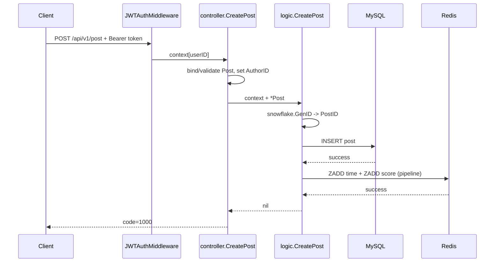

# 核心调用链

## 阅读方法

每条链都按“触发 → 参数/身份 → 业务决策 → 数据副作用 → 响应/终止”阅读。先掌握发帖这条跨 MySQL/Redis 的主链，再学习投票状态转换；登录链用于理解身份如何进入主链。

## 1. 进程启动链

**触发与结果**：运行 `main`，成功后监听配置端口，提供 HTTP、静态页面、Swagger 和 pprof；任一基础设施初始化失败则进程不进入服务状态。

| 步骤 | 文件/符号 | 输入 | 决策或动作 | 输出/下一跳 |
| --- | --- | --- | --- | --- |
| 1 | `main.go: main` | 当前工作目录 | 开始串行初始化 | `setting.Init` |
| 2 | `setting/setting.go: Init` | `./conf/config.yaml` + 环境变量 | 读取并反序列化，注册文件监听 | `conf.Conf` |
| 3 | `logger/logger.go: InitLogger` | log 配置、mode | dev 同时写控制台和滚动文件 | 全局 `zap.L()` |
| 4 | `pkg/jwt/jwt.go: Init` | 至少 32 字节的配置密钥 | 注入 HS256 签名密钥 | JWT 可用或启动终止 |
| 5 | `dao/mysql/mysql.go: InitMySQL` | MySQL 配置 | 建立连接并 `AutoMigrate` 三个模型 | 全局 GORM `db` |
| 6 | `dao/redis/redis.go: InitRedis` | Redis 配置 | 建立客户端并 `PING` | 全局 Redis `client` |
| 7 | `pkg/snowflake/snowflake.go: Init` | start time、machine ID | 设置 epoch 并创建 node | 可调用 `GenID` |
| 8 | `controller/validator.go: InitTrans` | `zh` | 注册中文校验消息 | 全局 translator |
| 9 | `router/router.go: SetupRouter` | Gin mode | 装配路由与中间件 | `*gin.Engine` |
| 10 | `main.go: http.Server` | port、engine | 异步监听；等待系统信号 | 请求服务或优雅关闭 |

**失败与终止**：步骤 2–8 任一报错都会记录并 `return`；监听产生非正常关闭错误会 `Fatal`；收到 `SIGINT/SIGTERM` 后以 5 秒 context 调用 `Shutdown`。

## 2. 登录与认证链

### 登录

| 步骤 | 文件/符号 | 输入 | 决策或动作 | 输出/下一跳 |
| --- | --- | --- | --- | --- |
| 1 | `router/router.go: SetupRouter` | `POST /api/v1/login` | 路由到登录 handler | `LoginHandler` |
| 2 | `controller/user.go: LoginHandler` | JSON username/password | `ShouldBindJSON` + required 校验 | `models.ParamLogin` |
| 3 | `logic/user.go: Login` | 参数 DTO | 构造 `models.User` | `mysql.Login` |
| 4 | `dao/mysql/user.go: Login` | username、明文输入密码 | 按用户名查询；计算摘要并比较 | 填充 `UserID/Username` 或错误 |
| 5 | `pkg/jwt/jwt.go: GenToken` | user ID、username | HS256 签名，7 天过期 | token string |
| 6 | `controller/response.go: ResponseSuccess` | token | 包装业务响应 | `{code:1000,msg:"success",data:token}` |

**关键异常**：无法绑定或不满足长度规则的参数返回 HTTP 400；用户不存在、密码错误分别映射为 `CodeUserNotExist`、`CodeInvalidPassword`，其余错误映射为 `CodeServerBusy`。新密码为 bcrypt；旧版摘要验证成功后由 `dao/mysql/user.go: Login` 自动更新为 bcrypt。

### 受保护请求

```text
Authorization: Bearer <token>
  -> JWTAuthMiddleware
  -> jwt.ParseToken
  -> gin.Context["userID"] = claims.UserID
  -> 具体 Handler
  -> getCurrentUser
```

缺少头返回业务码 `CodeNeedLogin`；格式或 token 无效返回 `CodeInvalidToken`，两者均会 `Abort`。`GET /api/v1/posts` 位于中间件注册前，不经过此链。

## 3. 发布帖子主链

**触发与预期结果**：已登录用户提交标题、正文和社区 ID；成功后 MySQL 有帖子记录，Redis 的时间榜与分数榜都有该 post ID。



| 步骤 | 文件/符号 | 输入 | 状态变化 | 下一跳/输出 |
| --- | --- | --- | --- | --- |
| 1 | `middlerwares/auth.go: JWTAuthMiddleware` | Bearer token | Gin context 写入 user ID | `CreatePost` |
| 2 | `controller/post.go: CreatePost` | JSON → `models.Post` | `AuthorID` 取自 context，覆盖客户端身份 | `logic.CreatePost` |
| 3 | `logic/post.go: CreatePost` | context、post pointer | `PostID = snowflake.GenID()` | `mysql.CreatePost` |
| 4 | `dao/mysql/post.go: CreatePost` | 完整 Post | 插入 `posts` | 成功后继续 Redis |
| 5 | `dao/redis/vote.go: CreatePost` | post ID | pipeline 写 `post:time` 与 `post:score`，初始 score 都是当前 Unix 时间 | 返回 error/nil |
| 6 | `controller/response.go` | logic 结果 | 无错误为成功，否则 `CodeServerBusy` | HTTP 200 业务响应 |

**一致性与失败**：MySQL 写入失败时 Redis 不执行；MySQL 成功而 Redis 失败时，`logic.CreatePost` 调用 `mysql.DeletePost` 补偿并返回“服务繁忙”。补偿也失败时使用 `errors.Join` 同时保留两项错误。该方案消除了常见的半完成帖子，但仍没有跨存储原子事务、重试或幂等键。

## 4. 投票状态转换链

**触发与预期结果**：已登录用户对 7 天内且存在 Redis 时间榜的帖子投 `-1/0/1`，更新总分并保存或删除个人投票状态。

| 步骤 | 文件/符号 | 输入 | 决策或动作 | 输出/下一跳 |
| --- | --- | --- | --- | --- |
| 1 | `controller/vote.go: VoteHandler` | JSON post_id/direction | 校验 post ID 为数字、direction 为 `-1/0/1`；取 context user ID | `logic.VoteForPost` |
| 2 | `logic/vote.go: VoteForPost` | int64 user ID、参数 | user ID 转字符串；direction 转 float64 | Redis DAO |
| 3 | `dao/redis/vote.go: VoteForPost` | user、post、new vote | 先拒绝非法值，再执行 `voteScript` | Redis 内原子状态转换 |
| 4 | `dao/redis/vote.go: voteScript` | 三个 ZSET key + 参数 | 校验帖子存在与 7 天窗口，读取旧票 | 不存在/过期则终止 |
| 5 | 同上 | 旧票、新票 | `delta=(new-old)*432`，更新分数 | `ZINCRBY post:score` |
| 6 | 同上 | 新票 | 非 0 时按 user ID `ZADD` 并设置剩余 TTL；0 时按 user ID `ZREM` | 原子提交 |
| 7 | `controller.ResponseSuccess/Error` | 领域错误 | 不存在、过期、非法值或服务错误映射为明确业务码 | HTTP 200 |

状态变化公式可用于手工预测：

| 旧票 → 新票 | 分数变化 |
| --- | ---: |
| 0 → 1 | +432 |
| 0 → -1 | -432 |
| 1 → 0 | -432 |
| -1 → 0 | +432 |
| -1 → 1 | +864 |
| 1 → -1 | -864 |

**当前保证**：分数和个人投票记录由同一个 Lua 脚本原子更新；取消分支按 `userID` 删除，Redis 查询错误不会再被零值吞掉。本轮容器 smoke test 验证了 `1 → 0` 后个人投票集合大小为 0。并发竞争仍应补专门的 Redis 集成测试。

**终止流程**：7 天后脚本拒绝新投票，个人投票 key 按剩余窗口自动过期；注释声称的票数汇总到 MySQL 仍没有触发器、worker 或对应 DAO。

## 5. 帖子列表与详情链

列表链为 `GET /api/v1/posts → controller.PostList → getPageInfo → logic.PostList → mysql.PostList → ResponseSuccess`。分页解析失败时默认为 `page=1,size=10`；数据库固定按 `create_time DESC`，并只选择部分 Post 字段。`models.ParamPostList` 的 `community_id/order` 尚未接入。

详情链为 `GET /api/v1/post/:id → JWTAuthMiddleware → controller.GetPostByID → strconv.ParseInt → logic.GetPostByID → mysql.GetPostByID → ResponseSuccess`。虽然定义了 `models.ApiPostDetail`，当前 handler 实际只返回 `*models.Post`，不拼接作者名、社区或 Redis 票数。

## 建议的安全练习

1. 不改代码，画出发帖成功和 Redis 失败两条时序，标出最终状态差异。
2. 给定旧票 `-1` 和新票 `1`，先算出分数变化，再对照 Lua 中的 `(new-old)*432`。
3. 只读比较 `router.SetupRouter` 与 `docs/swagger.yaml`，列出 Swagger 未覆盖的路由。
4. 为下一批集成测试设计四个断言：无 token、MySQL 发帖失败、Redis 发帖失败且补偿失败、并发投票。现有单元测试和 smoke test 尚未覆盖全部边界。
